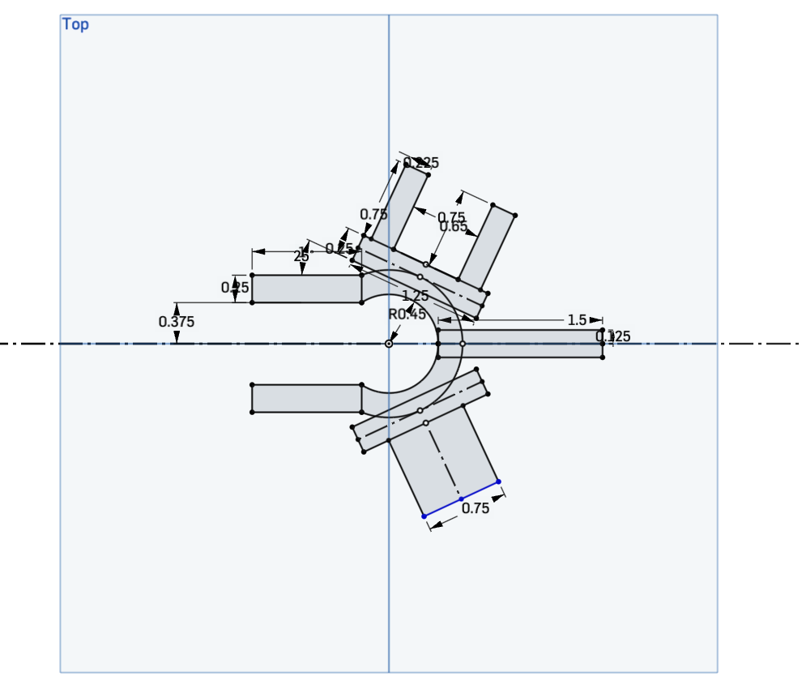
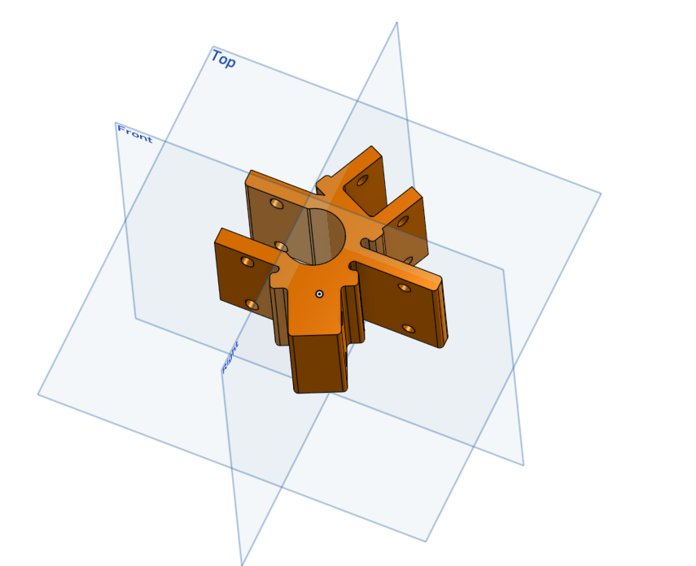
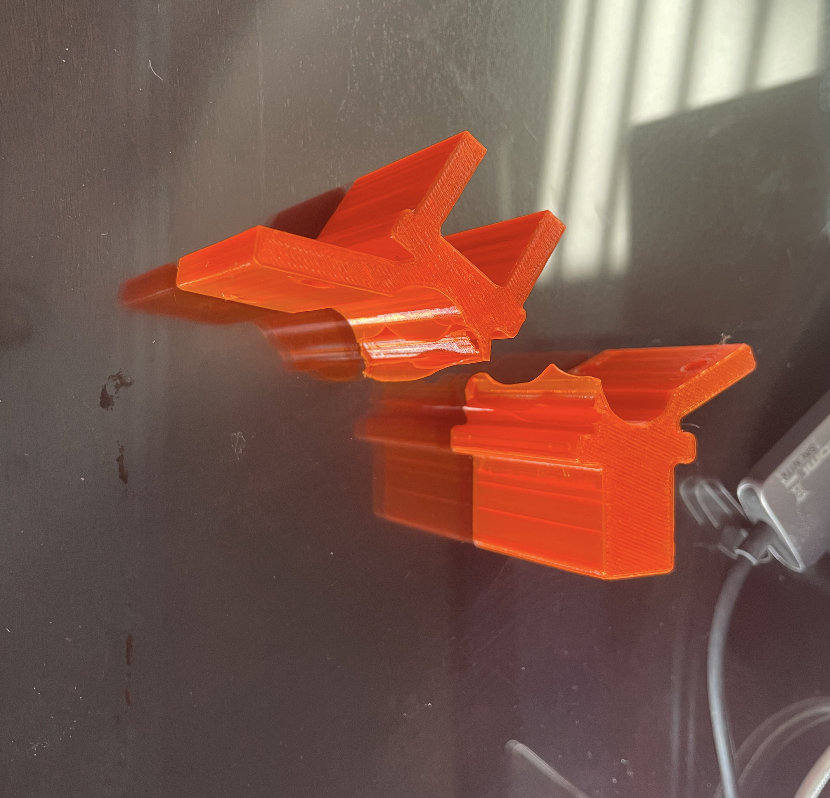
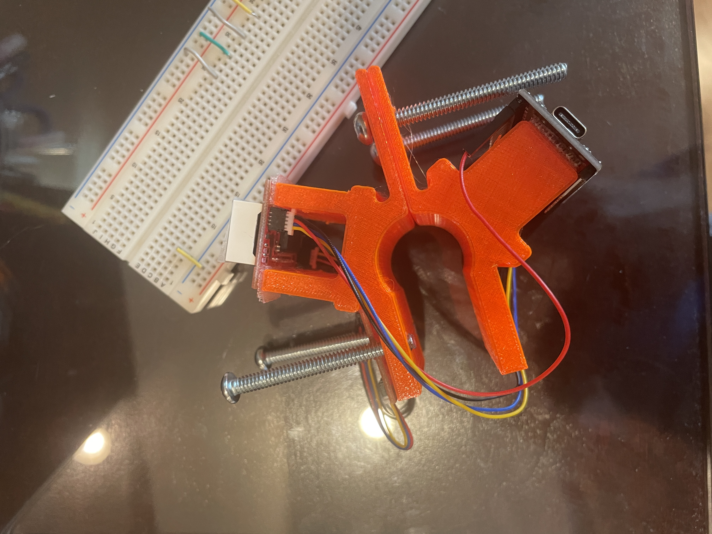
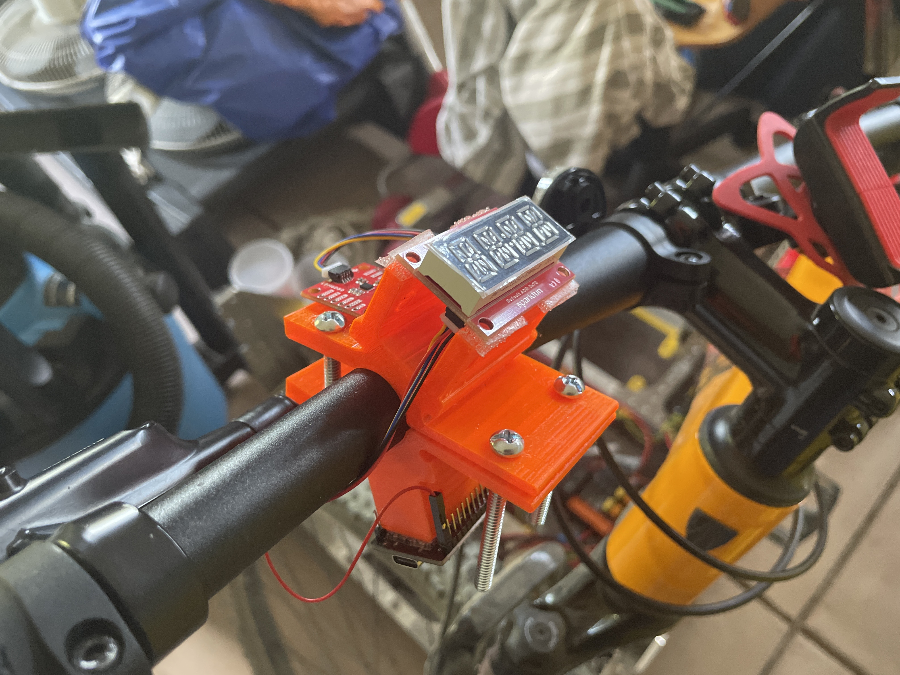

# ESP32-Bike-Display
One of my favorite things to do in my free time is to mountain bike with friends. There are a ton of good trails near my place, so it's very convenient to simply decide to go on a bike ride with my friends any weekend. During some of the trails, I sometimes wonder how fast I'm actually going on my bike, or how steep a certain hill is. Thus, I decided to create a bike display to display the slope gradient or my speed while I'm riding my bike.

## Hardware

First, one of the major problems I thought about was figuring out how to mount the ESP32, breakout sensor, and the seven-segment alphanumeric display onto the bike. I wanted to keep everything close together, just to ensure that wires wouldn't get entangled and put my safety in danger while riding my bike. So, I decided I was going to keep all three modules into one main mount which acts as a handlebike mount. 

I 3D printed my first version of the mount a double-screw handlebar mount, which included a mount for the seven-segment display at a 20° angle, a mount for the breakout sensor that was parallel to the ground, and the microcontroller under the handlebar and facing towards the back of the bike in order to ensure it's partly shielded from incoming dust during a bike ride. All electrical modules are mounted to the 3D printed mount using multiple 3M locks, as I had many of them left over from my time in the FIRST LEGO League.

  
  

The first time I attempted to mount this on my bike, I bended the mount a little too much while attempting to slot it into the handlebars, and it eventually split in half (Picture of the broken mount below) So, it was back to the drawing board for me. 

  

After learning from my earlier mistake, I decided to split the mount into two halves, so instead of stressing the mount while attempting to slot it onto the handlebars, I could simply put one half of the mount on the top of the handlebar, and the other half below, and simply use four screws towards each corner of the mount to ensure the mount "clamps" to the handlebars and stays in place. When testing, this proved to be effective, ensuring the mount was fastened in place without having to withstand as much stress and bending while mounting as the first version did.

  
  

## Electrical

Power is delivered to the ESP32 through a USB to USB-C type cable connected to a battery pack which is mounted to the top tube of the bike via another set of velcro locks. As the leads on the ESP32-Wroom microcontroller are already pre-soldered onto the board, I decided to not make my life complicated, and instead simply use Qwiic connectors to daisy chain the microcontroller to the alphanumeric display to the breakout sensor. Since the output voltage of the ESP32 was 5 volts, and as the input voltage of the breakout sensor and the alphanumeric display was 3 volts, the resistance from the alphanumeric display was not great enough for a significant voltage drop, thus all modules received the necessary voltage needed to operate.

  

## Software
Since I was using the Qwiic connectors to connect the breakout sensor to the alphanumeric display to the ESP32 in a daisy chain fashion, it was necessary to use I2C serial communication in order to have the ESP32 communicate with the alphanumeric display and breakout sensor. The microcontroller reads the data from the breakout sensor, and then writes that data to the alphanumeric display in order to display the data on the screen. Then, the data is cleared from the screen as the new data from the breakout sensor is fetched. This loops constantly while the ESP32 is fed power from the battery pack. 

